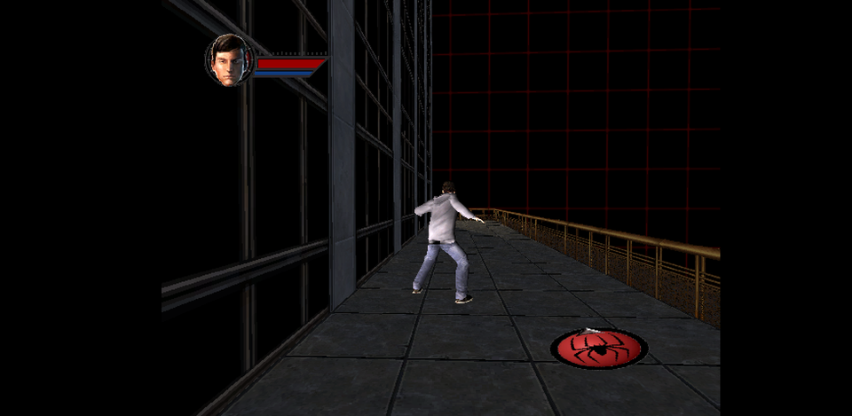

# Rustemu

A Rust port of an original Xbox (2001) emulator, packaged as a RetroArch
libretro core. Targets Xbox Series X via UWP RetroArch and Windows desktop.


<p align="center">
  
  <br>
  <em>Spider-Man (Activision, 2002), May 2026 — currently rendering at ~6 FPS. Performance work is open.</em>
</p>

## Status

In active development. See commit history for current state.

## Build

```
cargo build --release
```

The resulting DLL at `target/release/rustemu_core.dll` is a libretro core
for RetroArch.

## Requirements

- Rust stable
- Windows (other platforms not currently supported)
- An Xbox game (`.xbe` file) you legally own a copy of

This emulator does not require an Xbox BIOS dump or kernel binary. The
Xbox kernel APIs are implemented in clean-room Rust (high-level
emulation). You only need to provide your own legally-obtained game XBE.

This project does not include any Xbox games or Microsoft software.

## License

GPL-2.0-only. See [LICENSE](LICENSE).

This matches Cxbx-Reloaded's license (which Rustemu may incorporate or
cross-pollinate code with). Pinning to `GPL-2.0-only` rather than
`-or-later` avoids any ambiguity if upstream code is brought in.

## Architecture

The emulator follows a hybrid HLE + AOT design:

- **AOT (Ahead-of-Time)** x86-32 to x64 binary translation of guest code
  (CRT, game logic, math, application code)
- **HLE (High-Level Emulation)** of Xbox kernel ordinals, Direct3D 8, and
  DirectSound APIs
- **D3D11 GPU backend** with software-rasterizer fallback
- **VEH-based exception handling** for guest sign-extension, MMIO traps,
  and INT3 hook dispatch

### Guest-host context: the VLAN encapsulation model

Translation between guest x86-32 and host x64 borrows a conceptual model
from Ethernet VLAN tagging:

- The **host x64 environment** is the carrier — the always-present
  context that surrounds and transports every translated unit.
- The **guest x86-32 instruction stream** is the tagged frame — the
  payload being carried across the host.
- The **pinned register set** is the VLAN tag — four host registers
  reserved on every translated block to identify guest-vs-host state:

  | Host register | Carries |
  |:-:|---|
  | `R15` | Guest memory base (4GB `VirtualAlloc2` reservation, 512MB RAM mirroring) |
  | `R14` | Guest ESP (32-bit guest stack pointer) |
  | `R13` | AOT runtime context pointer |
  | `R12` | Shadow stack (return-address cache for RET dispatch) |

Because the tag is carried in physical CPU registers rather than in
memory, every translated instruction can dereference guest state in
~zero cycles, and host code can step in at any boundary (kernel call,
MMIO trap, exception) by reading the tag directly.

### Translation pipeline

The guest instruction stream passes through three stages:

1. **[iced-x86](https://github.com/icedland/iced)** decodes each guest
   instruction — operand decoding, addressing modes, instruction layout.
   This is the only step that touches the raw x86-32 byte stream.
2. **AOT translator** (`src/xbox/aot/emitter.rs`) emits the x64
   equivalent for the vast majority of decoded instructions: arithmetic,
   control flow, memory accesses, system instructions. Output is host
   machine code in an executable code buffer, addressed by guest PC.
3. **Micro-interpreter** (`src/xbox/aot/micro_interp.rs`) handles the
   small remainder: self-modifying code regions, dynamically-discovered
   jump targets, edge cases of x86 encoding the AOT translator can't
   safely emit. Interpreted execution is slower but semantically
   equivalent, and the pinned-register tagging works identically.

In practice, ~99% of guest code is AOT-translated and runs at near-host
speed. The remaining instructions fall through to the interpreter,
which preserves correctness without forcing the AOT to handle every
pathological case.

## Troubleshooting methodology — the OSI model for binary translation

Diagnosing AOT/emulation bugs is structurally similar to diagnosing
network problems. This project uses the OSI 7-layer model as a mental
framework for fault isolation: when a guest program misbehaves, ask
which layer the symptom belongs to and fix the lowest broken layer first.

| Layer | Networking equivalent | Emulator equivalent |
|------:|-----------------------|---------------------|
| 1 | Physical | Host CPU instruction execution |
| 2 | Data Link | x86 instruction decode + x64 emission |
| 3 | Network | Control flow: branches, CALL/RET, shadow stack |
| 4 | Transport | Guest state transitions, kernel-call dispatch |
| 5 | Session | SEH / VEH exception sessions, frame discipline |
| 6 | Presentation | Vertex/pixel shader translation, texture decode |
| 7 | Application | Game-specific HLE hooks, OOVPA pattern matching |

Each layer can fail independently. Bugs at lower layers cascade upward
and present as confusing symptoms higher up: a missing R15 sign-extension
fixup (L1/L2) can look like a render-target cache miss (L7). The
discipline is to identify the layer first, then diagnose within it. This
framing has paid for itself many times over.

## Acknowledgements

This project draws on many established emulator and interoperability
projects. Most implementation is clean-room Rust written from public
documentation and behavioural observation; a subset of files are
**explicit ports** of upstream GPL-2.0 code (primarily from
Cxbx-Reloaded). Every ported file carries an in-file
`Ported from` / `Source:` / `Derived from` comment pointing at the
upstream file. Full per-file attribution and upstream copyright is
recorded in [THIRD_PARTY_NOTICES.md](THIRD_PARTY_NOTICES.md).

The high-level breakdown:

- **Direct GPL-2.0 ports from Cxbx-Reloaded** — FVF decode, D3D
  render-state enum, host VS constant register layout, screenspace
  transform helper. Files: `src/xbox/gpu/{fvf_decode,render_state,mod,
  d3d11,nv2a_vsh}.rs`.
- **Ports from this project's C++ predecessor (XboxLibretro)** — VEH
  dispatch, DPC injection, kernel HLE for file/HAL/memory.
- **API-spec mirrors** — Xbox kernel ordinal X-macros
  (`src/xbox/kernel/ordinals.rs`).
- **Clean-room from documentation/observation** — everything else
  (AOT translator, emitter, micro-interpreter, OOVPA engine, GPU
  backends, runtime, VEH orchestration, etc.).

Beyond direct ports, each of the projects below contributed design ideas
that informed the architecture:

### Emulator architecture
- **[Cxbx-Reloaded](https://github.com/Cxbx-Reloaded/Cxbx-Reloaded)**
  (GPL-2.0) — OOVPA pattern matching design, D3D8 HLE stub structure, and
  the general HLE + API-intercept approach to Xbox emulation.
- **[xemu](https://github.com/xemu-project/xemu)** (GPL-2.0) — NV2A GPU
  emulation reference, particularly vertex shader translation, pushbuffer
  parsing, and PRAMIN/PFIFO behaviour.
- **[Xenia](https://github.com/xenia-canary/xenia-canary)** (BSD-3-Clause)
  — Reference for modern multi-threaded emulator architecture, x64-host
  AOT/JIT translation patterns, and async GPU command-processor design
  for the broader Xbox lineage.

### Binary translation
- **[box64](https://github.com/ptitSeb/box64)** (MIT) — x86-32 → x64 AOT
  translation reference, register pressure handling, and code emission
  patterns.
- **[FEX-Emu](https://github.com/FEX-Emu/FEX)** (MIT) — Reviewed for
  x32/x64 bit translation architecture and runtime dispatch design.

### Runtime / instrumentation
- **[Wine](https://www.winehq.org/)** (LGPL-2.1) — NT-style kernel API
  semantics (file I/O, SEH frame discipline, FS segment / TEB layout) and
  the R14/R15 register-anchor pattern for guest stack and memory base.
- **[Frida](https://github.com/frida/frida)** — Inspired the R11/R12
  shadow-stack pattern and the interceptor/stalker approach to runtime
  trampolines.

### Kernel / OS surface
- **[ReactOS](https://reactos.org/)** (GPL-2.0) — Reference for Windows
  kernel ordinal behaviour, NT API semantics, and HAL conformance.
- **[pyxbe](https://github.com/mborgerson/pyxbe)** (MIT) — XBE file
  format parsing reference and ordinal table layout.

### Graphics
- **[nxdk](https://github.com/XboxDev/nxdk)** — Xbox graphics primitive
  validation, including initial triangle test cases.
- **[RPCS3](https://github.com/RPCS3/rpcs3)** (GPL-2.0) — Reviewed for
  GPU command processor async architecture and texture cache patterns.

### Documentation sources
- **[xboxdevwiki](https://xboxdevwiki.net/)** — NV2A hardware spec, XBE
  format reference, kernel ordinal documentation.
- **[envytools](https://github.com/envytools/envytools)** — NVIDIA GPU
  family documentation including NV2A vertex/pixel shader formats.
- The broader Xbox homebrew and emulation community for two decades of
  collective reverse-engineering work.

### Methodology note

The OSI-model framing of AOT troubleshooting described above is original
to this project and is the methodological backbone of how bugs get
diagnosed here. Each new investigation starts by identifying the layer
the symptom belongs to before any code change is proposed.
